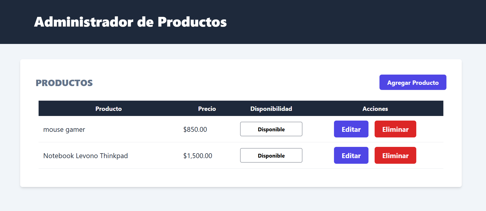

<!-- Banner -->


# 👋 ¡Hola gracias por visitar mi Proyecto!

## 🚀 Proyecto: Administrador de Productos

Este es el frontend de **Administrador de Productos**, una aplicación web diseñada para gestionar productos de manera eficiente. Con esta aplicación, puedes visualizar, agregar, modificar y eliminar productos, así como cambiar su disponibilidad.

## 🛠️ Tecnologías Utilizadas

- **React**: Librería para construir interfaces de usuario.
- **React Router DOM**: Manejo de rutas dentro de la aplicación.
- **Axios**: Cliente HTTP para realizar peticiones a la API.
- **Tailwind CSS**: Framework de CSS para estilizar la aplicación.
- **TypeScript**: Un superset de JavaScript que añade tipos estáticos.
- **Zod**: Librería de validación de esquemas para TypeScript.
- **Loader y Action**: Funciones de React Router para cargar datos y manejar acciones.
- **useFetcher**: Hook de React Router para actualizar la disponibilidad de los productos sin recargar la página.

## 🎥 Demostración

Puedes ver una demostración en video de cómo funciona la aplicación en [este enlace de YouTube](https://www.youtube.com/watch?v=OPiSc6o85jY&t=11s).

## 📝 Funcionalidades Principales

- **Visualización de Productos**: Los productos se muestran en una tabla organizada, con columnas para el nombre, precio, disponibilidad, y acciones.
- **Agregar y Modificar Productos**: Un solo formulario permite tanto agregar nuevos productos como modificar los existentes.
- **Eliminar Productos**: Los productos pueden ser eliminados con confirmación para evitar errores accidentales.
- **Cambiar Disponibilidad**: Un botón permite cambiar la disponibilidad del producto utilizando `useFetcher` para hacer la actualización en tiempo real.

## 📂 Estructura del Proyecto

```bash
src/
├── components/       # Componentes reutilizables
├── helpers/          # formatearDinero
├── layouts/          # Layout principal
├── services/         # Servicios y lógica de negocio
├── types/            # Types de TypeScript
└── views/            # Páginas de la aplicación
```
## 🚀 Cómo Empezar
1. Clona el repositorio:

```bash
git clone https://github.com/RodrigoLoboDev/REST_API_FRONTEND-PRODUCTS
```
2. Instala las dependencias:

```bash
npm install
```

3. Inicia el servidor de desarrollo:

```bash
npm run dev
```

## 🤝 Contribuciones
Las contribuciones son bienvenidas. Si tienes ideas para mejorar el proyecto, no dudes en abrir un issue o hacer un pull request.

## 📧 Contacto
- Email: rolobo2812@gmail.com
- LinkedIn: [Jesús Luis Rodrigo Lobo](https://www.linkedin.com/in/jes%C3%BAs-luis-rodrigo-lobo-6594a81b4/)
- GitHub: [RodrigoLoboDev](https://github.com/RodrigoLoboDev)

#### ⭐️ Si te gusta lo que hago, no dudes en seguirme y contribuir a mis proyectos. ⭐️